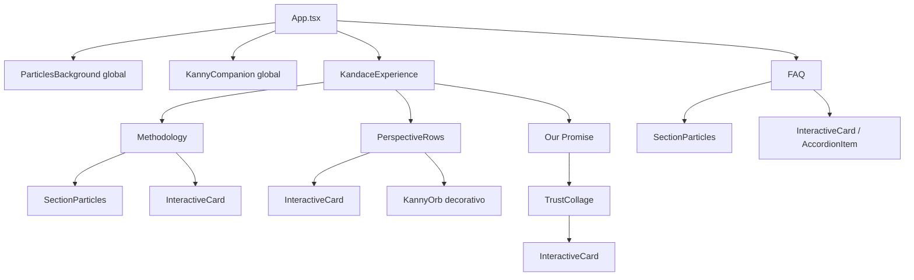
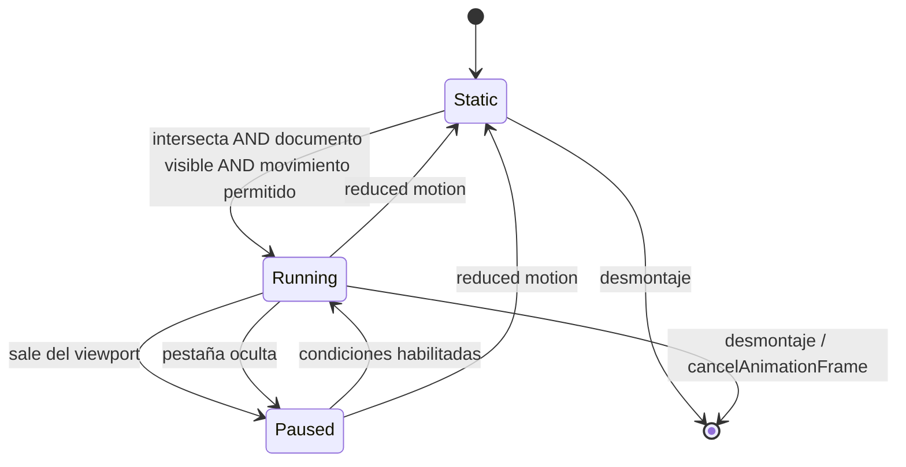

# Diseño técnico: Mejoras interactivas de la landing

## 1. Objetivo y alcance

Este diseño amplía la landing React existente sin alterar su narrativa principal ni la filosofía **Calm Tech**. La solución formaliza una entrada en la que Kanny aparece grande, dormido y exactamente centrado en un overlay de pantalla completa, despierta por activación o tras 2 segundos y se acopla visualmente al companion flotante; además introduce tarjetas con respuesta equivalente para puntero y teclado, partículas locales en Methodology y FAQ, una composición alternada para “Una experiencia, dos perspectivas” y un collage de confianza prudente dentro de Our Promise.

La implementación conservará el canvas global, el companion fijo, GSAP, Framer Motion, la paleta oscura y el contenido explicativo actual. El overlay y el companion se coordinarán como dos hosts de una sola identidad visual y semántica de Kanny, sin duplicación perceptible durante el traspaso. No se introducirán logos, clientes, certificaciones, avales ni relaciones comerciales sin evidencia documental. El breakpoint normativo es `768px`.

## 2. Estado actual y decisiones arquitectónicas

La aplicación es una SPA React 18 + TypeScript + Vite. `App.tsx` compone un canvas global, el companion y las secciones; `KandaceExperience.tsx` contiene Hero, Methodology, las dos perspectivas y Our Promise; `FAQ.tsx` controla el acordeón; GSAP desplaza el companion y Framer Motion revela contenido.

Decisiones:

1. **Separar decoración de contenido:** `SectionParticles` será un canvas puramente decorativo, montado exclusivamente en Methodology y FAQ. El canvas global existente se conserva fuera de estas secciones; el fondo negro opaco de las dos secciones evita superposición visual.
2. **Un solo patrón de tarjeta:** `InteractiveCard` centralizará borde luminoso, elevación, foco y movimiento reducido. Framer Motion seguirá controlando entradas, no hover, para evitar dos motores escribiendo `transform` sobre el mismo nodo.
3. **Un solo companion global:** las nuevas instancias inline de Kanny serán ilustraciones en flujo, estáticas y `aria-hidden`; no sustituirán ni competirán semánticamente con `KannyCompanion`.
4. **Datos de confianza cerrados y auditables:** el collage se renderizará desde datos tipados. Las prácticas requieren texto factual y referencia interna; los principios sin evidencia se presentan como marcos de diseño, nunca como certificaciones.
5. **Movimiento como mejora progresiva:** el contenido parte visible y funcional. GSAP, Framer Motion, canvas e IntersectionObserver solo enriquecen la presentación.
6. **Una sola identidad de Kanny durante el arranque:** `AwakeningOverlay` posee la representación visual y semántica mientras está activo. `KannyCompanion` reserva su destino, pero permanece `visibility: hidden` y `aria-hidden` hasta el handoff. La transición usa una geometría compartida medida, no dos Kannys visibles ni timelines independientes.

### 2.1 Estado de arranque y ownership

El flujo será una máquina de estados explícita, sin booleanos que puedan producir combinaciones imposibles:

```ts
type AwakeningPhase = 'sleeping' | 'awake' | 'handoff' | 'docked';
type WakeReason = 'pointer' | 'keyboard' | 'timeout';

interface AwakeningState {
  phase: AwakeningPhase;
  reason: WakeReason | null;
}
```

Transiciones válidas: `sleeping -> awake -> handoff -> docked`. `requestWake(reason)` será idempotente: la primera causa gana, cancela el timeout y las activaciones posteriores no reinician la secuencia. `App` será propietario de `phase`; `AwakeningOverlay` emitirá intención y fin de transición, y `KannyCompanion` recibirá `phase` para reservar o asumir la representación. Esto evita que el desmontaje del overlay y el montaje del companion se coordinen mediante delays implícitos.

Mientras `phase !== 'docked'`, el overlay es el único propietario accesible de Kanny y el companion está oculto tanto visualmente como para tecnologías de asistencia. Al finalizar, el overlay se desmonta y el companion asume el nombre accesible “Kanny, tu asistente de concentración”. Las representaciones inline de perspectivas siguen siendo decorativas y no participan en este ownership.



## 3. Archivos afectados por la futura implementación

| Archivo | Cambio previsto |
|---|---|
| `src/components/SectionParticles.tsx` | **Nuevo.** Canvas local, lifecycle de RAF, `IntersectionObserver`, `visibilitychange`, ResizeObserver, DPR limitado y reduced motion. |
| `src/components/InteractiveCard.tsx` | **Nuevo.** Superficie reutilizable con estrategias de foco `self`/`within` y acentos cian/azul. |
| `src/components/TrustCollage.tsx` | **Nuevo.** Collage de cuatro marcos genéricos y validación/normalización de claims. |
| `src/components/KandaceExperience.tsx` | Montar partículas en Methodology; migrar tarjetas; crear dos filas alternadas; integrar instancias inline de Kanny y collage. |
| `src/components/FAQ.tsx` | Fondo negro, partículas locales, patrón visual de tarjeta y relación accesible botón/panel. |
| `src/components/KannyOrb.tsx` | Añadir variantes `awakening`/`companion`/`inline`, tamaños responsive y opción de ojos estáticos para instancias decorativas. Mantener una única `ClippingDefs`. |
| `src/components/AwakeningOverlay.tsx` | Implementar fases dormido/despierto/handoff, layout full-viewport, control accesible, medición del destino, reduced motion y limpieza del timer. |
| `src/components/KannyCompanion.tsx` | Reservar el destino desde el primer render; exponer estado `reserved`/`docked` sin perder su nombre accesible ni su presencia global después del handoff. |
| `src/hooks/useEyeTracking.ts` | Limitar el selector a pupilas con `data-eye-tracking="true"`; no recorrer orbes decorativos. |
| `src/App.tsx` | Ser propietario de la fase de despertar; coordinar overlay→companion y condicionar GSAP a `prefers-reduced-motion: no-preference`; coordinar waypoint de perspectivas y limpiar triggers. |
| `src/index.css` | Tokens de despertar y tamaños de orbe, capas, pseudo-elemento luminoso, estados de foco/hover, responsive y reglas reduced motion. |

No se reemplazará `ParticlesBackground.tsx`: seguirá siendo el ambiente global existente. No se duplicarán `ClippingDefs`, controles ni contenido semántico.

## 4. Capas, fondo y continuidad visual

Methodology y FAQ usarán `background-color: #000`, `position: relative`, `isolation: isolate` y `overflow: hidden`. La pila será:

| Capa | z-index | Responsabilidad |
|---|---:|---|
| canvas global | `0` | Ambiente fuera de secciones negras |
| fondo negro local | `0` dentro del stacking context | Oculta el canvas global bajo Methodology/FAQ |
| `SectionParticles` | `1` | Partículas locales, `pointer-events: none` |
| halos/gradientes | `2` | Decoración estática tenue |
| contenido de sección | `10` | Texto, tarjetas y controles |
| companion global | `30` | Destino reservado durante overlay; acompañamiento fijo al quedar `docked` |
| navbar | `40` | Navegación una vez habilitada la landing |
| overlay de despertar | `50` | Capa `fixed inset-0`, único Kanny visible y control de activación durante el arranque |

No se usarán valores `z-index` negativos dentro de las secciones, porque podrían escapar del stacking context. Las superficies mantienen `rgba(15, 23, 42, 0.65)`, blur de 16px, acento `#22d3ee`, texto principal `#f8fafc` y secundario no inferior al contraste requerido. La validación final debe medir 4.5:1 para texto normal y 3:1 para texto grande o gráficos esenciales.

## 5. `SectionParticles`

### 5.1 Contrato

```ts
export interface SectionParticlesProps {
  density?: number;          // 28 móvil, 48 escritorio por defecto
  color?: string;            // rgba(34, 211, 238, 0.32)
  maxDpr?: number;           // 1.5 por defecto
  className?: string;
  testId?: string;
}

interface ParticleRuntimeState {
  intersecting: boolean;
  documentVisible: boolean;
  reducedMotion: boolean;
  canvasSupported: boolean;
}

export function shouldAnimateParticles(state: ParticleRuntimeState): boolean {
  return state.intersecting
    && state.documentVisible
    && !state.reducedMotion
    && state.canvasSupported;
}
```

Se instanciará exactamente dos veces:

```tsx
<section id="methodology" className="section-black">
  <SectionParticles testId="methodology-particles" />
  <div className="section-content">...</div>
</section>

<section id="faq" className="section-black">
  <SectionParticles testId="faq-particles" />
  <div className="section-content">...</div>
</section>
```

### 5.2 Ciclo de vida

- El canvas será `absolute inset-0 h-full w-full`, no `fixed`, y tomará las dimensiones de su sección con `ResizeObserver`.
- La resolución física será `cssWidth * min(devicePixelRatio, maxDpr)` y el contexto se escalará al DPR efectivo. El cap de `1.5` limita fill-rate en pantallas densas.
- `IntersectionObserver` usará `threshold: 0.01` y sin `rootMargin`: al salir completamente de viewport se cancela el único RAF activo; al reentrar se reanuda sin crear un segundo loop.
- `visibilitychange` cancelará RAF cuando `document.hidden` sea verdadero y solo lo reiniciará si la sección continúa intersectando.
- `matchMedia('(prefers-reduced-motion: reduce)')` cancela RAF y dibuja **un único frame estático**. Así se mantienen profundidad y contenido sin movimiento.
- El listener de la media query debe reaccionar a cambios en vivo y limpiarse al desmontar.
- Si faltan canvas 2D, RAF, observers o media query, el componente no lanza errores: omite movimiento o decoración y deja visible el contenido.
- El canvas tendrá `aria-hidden="true"`, `role="presentation"`, `tabIndex={-1}` y `pointer-events: none`.
- Las partículas locales no reaccionarán al puntero. Esto reduce listeners globales y evita que una decoración compita con FAQ o tarjetas.



## 6. `InteractiveCard`

### 6.1 Interfaz

```ts
import type { ElementType, HTMLAttributes, ReactNode } from 'react';

type CardAccent = 'cyan' | 'blue' | 'neutral';
type FocusStrategy = 'self' | 'within';

export interface InteractiveCardProps extends HTMLAttributes<HTMLElement> {
  as?: Extract<ElementType, 'article' | 'div' | 'li'>;
  accent?: CardAccent;
  focusStrategy?: FocusStrategy;
  children: ReactNode;
  elevated?: boolean;
}
```

- `focusStrategy="self"`: tarjeta informativa sin controles internos; añade `tabIndex={0}` y foco visible en la superficie.
- `focusStrategy="within"`: tarjeta con enlace/botón interno; el wrapper no entra al tab order y usa `:focus-within`. Evita dos paradas de teclado para Pricing y FAQ.
- No se asignará `role="button"` a una tarjeta que no ejecute una acción.

### 6.2 Apariencia y estabilidad

El borde luminoso será `::before`, con `position: absolute`, `inset: -1px`, `border-radius: inherit`, gradiente cian/azul, máscara que deja visible solo el anillo, `opacity` transicionable y `pointer-events: none`. El borde base mantendrá siempre el mismo ancho.

Hover (`@media (hover:hover) and (pointer:fine)`) y `:focus-visible`/`:focus-within` activarán:

- `transform: translate3d(0, -6px, 0)`;
- sombra `0 22px 65px rgba(6,182,212,.18)`;
- opacidad del pseudo-borde;
- incremento de luminosidad de fondo sin reducir contraste.

Solo se animarán `transform`, `box-shadow`, `background-color` y `opacity`; nunca `width`, `height`, `padding`, `margin`, `top` o el grosor de borde. La tarjeta conserva su caja y no mueve vecinas. En reduced motion se elimina la traslación y la transición; foco y hover siguen siendo perceptibles mediante borde, outline y sombra estáticos. `outline: 2px solid #67e8f9` con `outline-offset: 3px` queda reservado para foco de teclado.

Las tarjetas de Methodology, perspectivas, collage y los contenedores de FAQ adoptarán el patrón. Pricing puede conservar su composición isométrica, pero compartirá tokens de foco y no alterará el layout; su enlace usa `focus-within`.

## 7. “Una experiencia, dos perspectivas”

### 7.1 Modelo y composición

```ts
interface PerspectiveItem {
  id: 'employees' | 'hr';
  audience: 'Para empleados' | 'Para RRHH';
  title: string;
  description: string;
  accent: 'cyan' | 'blue';
  kannySide: 'left' | 'right';
}

const perspectives: readonly PerspectiveItem[] = [
  { id: 'employees', audience: 'Para empleados', kannySide: 'right', /* ... */ },
  { id: 'hr', audience: 'Para RRHH', kannySide: 'left', /* ... */ },
];
```

La sección recibirá `id="perspectives"` y dos filas `grid md:grid-cols-2`. El DOM se escribirá en el orden narrativo requerido, sin depender de `order` visual:

1. `Tarjeta_Empleados`
2. Kanny asociado a empleados
3. Kanny asociado a RRHH
4. `Tarjeta_RRHH`

En ancho `>=768px`, cada fila usa dos columnas `minmax(0, 1fr)` y `gap` estable: fila uno tarjeta/Kanny; fila dos Kanny/tarjeta. En ancho `<768px`, cada fila pasa a una columna y conserva exactamente el orden DOM anterior. Todos los hijos tendrán `min-width: 0`, los orbes usarán `max-width: 100%` y la sección no dependerá de offsets negativos, evitando overflow entre 320 y 767px.

### 7.2 Kanny inline y coordinación global

Las dos representaciones inline reutilizan `KannyOrb`, pero con variante decorativa:

```ts
interface KannyOrbProps {
  sleeping?: boolean;
  className?: string;
  variant?: 'companion' | 'inline';
  trackEyes?: boolean;
}
```

Para `variant="inline"`: `trackEyes={false}`, `aria-hidden="true"`, wrapper no enfocable, `pointer-events: none`, tamaño reservado con `aspect-ratio: 1`, halo estático y máximo aproximado de 220px. No comunican información adicional; la audiencia y el beneficio están en texto, por lo que ocultarlas evita repetición para lectores de pantalla. El hook de ojos solo seleccionará `[data-eye-tracking="true"] .kanny-pupil`.

`KannyCompanion` seguirá siendo la única instancia fija y con nombre accesible. Al entrar `#perspectives`, en escritorio se acoplará al gutter derecho, bajará de escala y luminosidad de forma sutil, sin ocultarse ni cruzar las filas. Las ilustraciones inline quedan dentro del contenido y sin etiqueta “Kanny está contigo”, diferenciando ambos roles. En móvil el companion conserva su posición fija inferior derecha y la sección reservará espacio inferior para que no tape texto. Con reduced motion permanece visible y estático en esa posición.

### 7.3 Entradas

Cada fila usa un único `motion.div` coordinador con `viewport={{ once: true, amount: 0.25 }}`. Los dos hijos aparecen con opacidad y desplazamiento horizontal opuesto de máximo 24px. El contenedor ya ocupa su tamaño final antes de animar. `useReducedMotion()` devuelve directamente `opacity: 1, x: 0`; no se monta una animación alternativa.

## 8. Our Promise y collage de confianza

`TrustCollage` se ubicará dentro de `#promise`, bajo el copy principal, como grid de cuatro marcos genéricos. No usará logos ni nombres de terceros. En escritorio puede usar una composición 2x2 con desplazamientos **internos mediante transform**; en móvil será una cuadrícula de una columna sin transformaciones, solapamientos ni posicionamiento absoluto.

### 8.1 Modelo de claims

```ts
type TrustKind = 'practice' | 'principle';
type TrustTopic =
  | 'local-first'
  | 'privacy-by-design'
  | 'data-minimization'
  | 'local-encryption';

interface EvidenceReference {
  id: string;
  source: string;
  reviewedAt: string; // ISO date
}

interface TrustSignal {
  id: TrustTopic;
  title: string;
  accessibleName: string;
  description: string;
  kind: TrustKind;
  evidence?: EvidenceReference;
}
```

Reglas de renderizado:

- `kind: 'practice'` exige `evidence`; describe de forma concreta qué se trata, dónde se almacena o si se transmite. Si falta evidencia, la señal no se publica como práctica y se normaliza a `principle` con copy no factual.
- `kind: 'principle'` usa expresiones como “principio de diseño”, “marco técnico” o “referencia aplicable”. Nunca usa “certificado”, “cumple”, “avalado”, “cliente de” o “adoptado por”.
- Cualquier futura organización, cliente, certificación o relación comercial requerirá evidencia documental revisada antes de incorporarse al dataset.
- Cada tarjeta tendrá `aria-label` o título visible asociado mediante `aria-labelledby`; los iconos Lucide serán decorativos.

Contenido inicial seguro:

| Marco | Formulación |
|---|---|
| Local-first | “El procesamiento se diseña para ejecutarse en el dispositivo y limitar transmisiones.” Solo se promoverá a práctica absoluta si la implementación completa está documentada. |
| Privacy by Design | “Principio de diseño: integrar privacidad desde la arquitectura y los valores predeterminados.” |
| Minimización de datos | “Principio: procesar únicamente las señales necesarias y evitar contenido escrito o capturas.” |
| Cifrado local | “Marco técnico para proteger en reposo los datos que deban persistirse en el dispositivo.” No afirma certificación ni que todo dato esté cifrado sin evidencia de implementación. |

El copy actual “100% on-device” y “Tus datos nunca dejan tu dispositivo” debe someterse a la misma evidencia. Si no se documentan todas las rutas de datos, se reemplaza por la formulación acotada de Local-first; este diseño no convierte copy de marketing en prueba técnica.

## 9. FAQ

FAQ conservará su estado de apertura única (`number | null`), pero cada item tendrá identificadores estables:

```tsx
<button
  id={`faq-trigger-${id}`}
  aria-expanded={isOpen}
  aria-controls={`faq-panel-${id}`}
>
  {question}
</button>
<div
  id={`faq-panel-${id}`}
  role="region"
  aria-labelledby={`faq-trigger-${id}`}
  hidden={!isOpen}
>
  {answer}
</div>
```

El botón mantiene foco visible y un área táctil mínima de 44px. `AnimatePresence` anima altura/opacidad solo si no hay reduced motion; de lo contrario el panel cambia inmediatamente. `SectionParticles` queda detrás y no intercepta clics ni teclado. El fondo negro y los tokens de texto aseguran separación y contraste.

## 10. Despertar inicial y handoff overlay→companion

### 10.1 Contrato de `KannyOrb` y tokens responsive

`KannyOrb` renderiza la misma geometría SVG en tres variantes; el tamaño pertenece al host para que la transición no cambie el viewBox ni reconstruya ojos o halo:

```ts
type KannyOrbVariant = 'awakening' | 'companion' | 'inline';
type KannyOrbState = 'sleeping' | 'awake';

interface KannyOrbProps {
  variant: KannyOrbVariant;
  state?: KannyOrbState;
  trackEyes?: boolean;
  labelled?: boolean;
  className?: string;
}
```

| Token | Valor | Uso |
|---|---|---|
| `--kanny-awakening-size` | `clamp(180px, 44vmin, 360px)` | Kanny grande inicial; cabe desde 320×568 y permanece inequívocamente mayor que el companion |
| `--kanny-companion-size` | `clamp(72px, 9vw, 112px)` | Destino flotante en vista amplia |
| `--kanny-companion-size-mobile` | `72px` | Destino estable entre 320 y 767px |
| `--kanny-inline-size` | `clamp(144px, 22vw, 220px)` | Ilustraciones decorativas de perspectivas |
| `--kanny-awake-halo` | `0 0 72px rgba(34,211,238,.48)` | Halo cian del estado despierto |
| `--awakening-duration` | `700ms` | Trayectoria centro→companion |
| `--awakening-overlay-fade` | `450ms` | Fade de fondo coordinado dentro del handoff |

La prueba geométrica exige además que el tamaño inicial sea al menos `1.6` veces el tamaño del destino calculado y no exceda `min(70vw, 70dvh)`. Si un viewport extremo no satisface ambas condiciones, prevalecen contención y ausencia de recorte. `sleeping` dibuja párpados cerrados y suprime tracking; `awake` muestra ojos abiertos, habilita tracking solo para las variantes que lo permiten y activa el halo cian. `ClippingDefs` continúa montándose una sola vez en `App`.

### 10.2 Layout de `AwakeningOverlay`

El overlay usa `position: fixed; inset: 0; width: 100%; min-height: 100vh; min-height: 100dvh; z-index: 50; overflow: clip` y no participa en el flujo. Su escenario central ocupa todo el viewport con `display: grid; place-items: center`. El shell del orbe se posiciona por su **propio centro**; instrucciones, etiqueta y halo están en capas absolutas independientes y no alteran el cálculo. Para cada resize u orientación, antes del handoff se verifica:

```ts
orbCenterX = orbRect.left + orbRect.width / 2;
orbCenterY = orbRect.top + orbRect.height / 2;
abs(orbCenterX - innerWidth / 2) <= 1;
abs(orbCenterY - innerHeight / 2) <= 1;
```

El fondo de la landing se marca `inert` y `aria-hidden="true"` mientras el overlay está activo. El overlay se expone como diálogo modal etiquetado y contiene un único `button type="button"` con nombre accesible “Despertar a Kanny”; el botón recibe foco inicial y responde nativamente a clic, Enter y Espacio. El texto auxiliar queda fuera de la caja usada para centrar el orbe. Al quedar `docked`, se eliminan `inert`/`aria-hidden`, se desmonta el overlay y el foco pasa al `h1` principal temporalmente enfocable; no se conserva un nodo transparente que intercepte eventos.

### 10.3 Transición visual compartida

La opción primaria es un **único shell visual de transición** propiedad de `AwakeningOverlay`. `KannyCompanion` monta desde el primer render un slot fijo vacío con su tamaño final para poder medirlo; usa `visibility: hidden`, `aria-hidden="true"` y no pinta otro orbe. Al despertar:

1. `awake` abre los ojos y activa el halo durante `300ms` antes del movimiento.
2. Al iniciar `handoff`, se leen en el mismo frame los `getBoundingClientRect()` del shell central y del slot destino.
3. Se anima únicamente `transform: translate3d(dx, dy, 0) scale(s)` del shell, con `transform-origin: center`; `dx/dy` unen ambos centros y `s = destination.width / source.width`. El fondo del overlay desvanece en paralelo, con una curva Calm Tech `cubic-bezier(.22,1,.36,1)`.
4. Al completar, una única actualización de estado cambia a `docked`: el companion se hace visible en la misma geometría final y el shell/overlay se retiran antes del siguiente frame observable.

Así existe un solo Kanny pintado y un solo propietario accesible en cada frame. No se permite un crossfade entre dos orbes con opacidad perceptible. Si no puede medirse el destino, el fallback omite la trayectoria y realiza el traspaso estático; nunca anima hacia coordenadas estimadas. `ResizeObserver` mantiene actualizado el slot y se realiza una medición final al comenzar; un resize durante el movimiento finaliza en el destino recalculado o aplica el fallback sin salto.

GSAP no controla este shell: el handoff se resuelve con Framer Motion o Web Animations en un único timeline, y los ScrollTriggers del companion se registran solo después de `docked`. Esto impide que dos motores escriban `transform` sobre el mismo elemento.

### 10.4 Movimiento reducido, temporizadores y limpieza

Con `prefers-reduced-motion: reduce`, se conservan los estados y tiempos funcionales: Kanny inicia dormido, despierta por activación o a los `2000ms`, abre los ojos y muestra un halo estático. Se eliminan respiración, pulso, spring, trayectoria y reducción animada. Tras el estado despierto, el ownership cambia inmediatamente al companion; el fondo puede usar un fade de opacidad de hasta `120ms`, sin movimiento espacial.

`AwakeningOverlay` conserva en refs `wakeTimer`, animación activa y estado montado. El timeout se programa una sola vez al entrar en `sleeping`, se cancela al ganar cualquier trigger y se limpia al desmontar. `requestWake` ignora llamadas cuando la fase ya no es `sleeping`, de modo que clic, teclado y timeout concurrentes no duplican callbacks. La limpieza también cancela `ResizeObserver`, media-query listeners, `requestAnimationFrame`, callbacks de finalización y cualquier animación Web Animations; ningún callback puede actualizar estado tras desmontaje.

### 10.5 Estabilidad visual

Overlay y shell usan capas `fixed`; la transición solo modifica `transform` y `opacity`. El slot del companion existe desde el primer render con tamaño, posición y `aspect-ratio: 1` finales, aunque no pinte contenido. La landing se renderiza en su layout definitivo debajo del overlay y no cambia márgenes, padding, altura ni scrollbars al despertar. La compensación de scrollbar, si fuese necesaria al bloquear interacción, se calcula antes del primer paint. Estas reglas mantienen invariantes las cajas del contenido y el objetivo global `CLS <= 0.1`.

## 11. Coordinación GSAP, Framer Motion y CSS

- **GSAP:** exclusivo para la trayectoria del companion global. `gsap.matchMedia()` registrará animaciones solo con `(min-width: 768px) and (prefers-reduced-motion: no-preference)`. El waypoint de `#perspectives` acopla el companion; Methodology, Promise, Pricing y FAQ mantienen sus transiciones. Cada setup vive en `gsap.context()` y revierte triggers, transforms y listeners al desmontar.
- **Framer Motion:** entradas de secciones, filas y acordeón. Todos los componentes consultan `useReducedMotion`; el estado inicial accesible es visible.
- **CSS:** hover, focus-visible, pseudo-borde y estados estáticos. Ningún elemento recibe simultáneamente transform de GSAP y Framer Motion.
- **Carga inicial:** `AwakeningOverlay` y el shell compartido aplican la máquina de estados de la sección 10; GSAP del companion no se registra hasta `docked`. En reduced motion el traspaso es estático y el companion no usa spring.

## 11. Accesibilidad

1. Mantener un `h1` único en Hero; Methodology, perspectivas, Our Promise y FAQ usan `h2`; tarjetas y preguntas usan `h3` o botones con texto, sin saltos jerárquicos.
2. `InteractiveCard` ofrece equivalencia hover/focus y no confunde superficie informativa con botón.
3. Canvas, halos, pseudo-elementos e instancias inline de Kanny son decorativos, `aria-hidden` y no enfocables. El companion global conserva su nombre accesible.
4. Toda imagen futura que aporte información necesita `alt` descriptivo; si repite texto cercano, usa `alt=""`.
5. FAQ expone `aria-expanded`, `aria-controls`, región y etiqueta asociada.
6. El orden DOM coincide con el orden visual y narrativo en móvil.
7. Se verifican contraste, foco no recortado, zoom al 200%, teclado completo y targets táctiles.
8. Reduced motion elimina RAF, scroll scrub, springs, desplazamientos de entrada y elevación animada, sin ocultar contenido.

## 12. Rendimiento, estabilidad y manejo de errores

- Dos canvas locales con 28/48 partículas y DPR 1.5; un solo RAF por canvas y pausa agresiva por intersección/pestaña.
- `ResizeObserver` recalcula solo cuando cambia la caja; el handler se agrupa en el siguiente frame y no lee/escribe layout en bucle.
- Partículas como objetos mutables en refs, sin `setState` por frame ni rerenders React.
- Dimensiones reservadas con `min-height`, `aspect-ratio` y grids finales antes de animar. Hover por transform no participa en layout.
- `will-change` solo durante hover-capable media query, no permanentemente en todas las tarjetas.
- Si falla canvas/observer/GSAP/Framer Motion, el HTML queda visible; los bloques no empiezan con `opacity: 0` fuera de un contexto que garantice activación.
- Un dataset de confianza inválido se rechaza en desarrollo con error descriptivo y en producción cae a la variante genérica segura; nunca publica una atribución no respaldada.
- Todo observer, media listener, RAF, timeout y ScrollTrigger se limpia al desmontar.
- Objetivos de producción móvil: Lighthouse Performance >=80, LCP <=2.5s y CLS <=0.1, medidos sobre `npm run build` y servidor de preview.

## 13. Propiedades de corrección

Las propiedades se consolidaron para evitar redundancia: el ciclo de partículas reúne viewport, pestaña y reduced motion; la composición responsive reúne ambas filas; la estabilidad geométrica reúne hover y entradas; y la política de claims reúne prácticas, principios y evidencia.

### Propiedad 1: Equivalencia y reversibilidad de la tarjeta

Para toda tarjeta interactiva, activarla mediante puntero o foco visible debe producir un realce perceptiblemente equivalente, y retirar esa activación debe restaurar exactamente su estado visual base.

**Validates: Requirements 1.1, 1.2, 1.3**

### Propiedad 2: Estabilidad geométrica de superficies animadas

Para toda tarjeta, representación de Kanny o elemento del collage y para cualquier transición de hover, foco o entrada, sus dimensiones reservadas y las posiciones de sus elementos adyacentes deben permanecer invariantes.

**Validates: Requirements 1.5, 8.6**

### Propiedad 3: Ciclo de ejecución de partículas locales

Para toda combinación de intersección de sección, visibilidad del documento, soporte de canvas y preferencia de movimiento, un canvas local debe ejecutar RAF si y solo si está intersectando, el documento está visible, hay soporte y no se solicita movimiento reducido; en cualquier otro caso debe estar pausado o mostrar un frame estático.

**Validates: Requirements 2.2, 5.2, 6.1, 8.1, 8.2**

### Propiedad 4: Composición alternada en vista amplia

Para todo ancho de viewport igual o superior a 768px, la primera fila debe ordenar Tarjeta_Empleados/Kanny y la segunda Kanny/Tarjeta_RRHH, cada una en dos columnas y sin alterar el orden narrativo de su contenido.

**Validates: Requirements 3.1, 3.2, 7.2**

### Propiedad 5: Orden y contención en vista estrecha

Para todo ancho entre 320 y 767px, las secciones modificadas deben satisfacer `scrollWidth <= clientWidth`; las perspectivas deben aparecer en el orden Tarjeta_Empleados, Kanny empleado, Kanny RRHH, Tarjeta_RRHH, y las señales del collage no deben solaparse.

**Validates: Requirements 3.3, 3.5, 4.7, 7.1**

### Propiedad 6: Entrada única de cada fila

Para toda fila de perspectivas y cualquier secuencia de entradas y salidas del viewport, su animación de entrada debe iniciarse como máximo una vez y finalizar con tarjeta y Kanny visibles.

**Validates: Requirements 3.4**

### Propiedad 7: Seguridad semántica de las señales de confianza

Para toda señal de confianza, una práctica, certificación, organización, cliente o relación comercial solo puede renderizarse como afirmación factual si posee evidencia documental; sin evidencia debe omitirse o transformarse en un principio genérico que no atribuya cumplimiento, certificación, aval, adopción ni relación.

**Validates: Requirements 4.2, 4.3, 4.4, 4.5**

### Propiedad 8: Nombre accesible del collage

Para toda lista válida de señales de confianza, cada señal renderizada debe exponer un nombre accesible no vacío y único dentro del collage.

**Validates: Requirements 4.6**

### Propiedad 9: Correspondencia del acordeón

Para toda pregunta y cualquier secuencia de apertura/cierre, `aria-expanded` debe ser verdadero exactamente cuando su panel asociado está abierto, y `aria-controls`/`aria-labelledby` deben formar una relación válida.

**Validates: Requirements 5.4**

### Propiedad 10: Política global de movimiento reducido

Para todo componente decorativo o animado, cuando reduced motion está activo no debe existir desplazamiento continuo, entrada desplazada, scroll scrub ni elevación animada; el contenido y el companion global deben permanecer visibles en posiciones estáticas.

**Validates: Requirements 6.1, 6.2**

### Propiedad 11: Semántica de elementos visuales

Para todo elemento visual, si es decorativo debe estar oculto del árbol accesible y fuera del orden de foco; si es informativo debe proporcionar una alternativa textual no vacía.

**Validates: Requirements 6.5, 6.6, 6.7**

### Propiedad 12: Degradación funcional

Para toda combinación de capacidades ausentes entre canvas, IntersectionObserver, ResizeObserver, RAF y motores de animación, todo texto, enlace, botón y control expandible debe seguir visible y operable mediante presentación estática.

**Validates: Requirements 8.7**

## 14. Estrategia de pruebas

El proyecto no tiene framework de tests instalado. La implementación deberá incorporar Vitest + React Testing Library + jest-dom para componentes, fast-check para propiedades y Playwright para navegador, accesibilidad visual y responsive. Las versiones se fijarán exactamente al momento de implementar.

### 14.1 Unitarias y de componente

- `shouldAnimateParticles`: tabla de verdad de intersección, visibilidad, soporte y reduced motion.
- start/stop idempotente de RAF; limpieza de observer, media query y visibility listener.
- `InteractiveCard`: `tabIndex`, estrategia `within`, clases activas y restauración.
- FAQ: toggle, apertura única, `aria-expanded`, `aria-controls` y panel.
- normalizador de `TrustSignal`: práctica con evidencia, práctica sin evidencia, principio y términos prohibidos.
- `KannyOrb`: companion con eye tracking e inline decorativo sin tracking.

### 14.2 Property-based tests

Cada propiedad ejecutará un mínimo de 100 casos y llevará una etiqueta con el formato requerido, por ejemplo:

- `Feature: interactive-landing-enhancements, Property 3: Ciclo de ejecución de partículas locales`
- `Feature: interactive-landing-enhancements, Property 5: Orden y contención en vista estrecha`
- `Feature: interactive-landing-enhancements, Property 7: Seguridad semántica de las señales de confianza`

fast-check generará secuencias de visibilidad, índices de FAQ, claims válidos/inválidos y anchos de viewport. Las propiedades geométricas y responsive se ejecutarán en Playwright con datos generados, no en jsdom.

### 14.3 Integración, accesibilidad y visual

- Teclado: recorrer todos los elementos interactivos con canvas montado; confirmar foco visible y que no se interceptan eventos.
- axe: ausencia de violaciones críticas, nombres accesibles, encabezados y relaciones del acordeón.
- Screenshots a 320, 375, 767, 768, 1024 y 1440px para fondos negros, filas, collage, foco y reduced motion.
- Medir bounding boxes antes/durante/después de hover y entrada para CLS local.
- Simular `prefers-reduced-motion`, pestaña oculta y entrada/salida del viewport.
- Confirmar exactamente un companion global, dos Kanny inline decorativos, un canvas global y dos canvases locales.
- Revisar contraste con estados base, hover, foco y FAQ abierto.

### 14.4 Rendimiento

Sobre build de producción, ejecutar Lighthouse móvil tres veces y tomar la mediana: Performance >=80, LCP <=2.5s, CLS <=0.1. Usar Performance panel para confirmar ausencia de RAF local fuera de viewport o con pestaña oculta y que no existen loops duplicados tras reentrar.

## 15. Trazabilidad y verificación explícita 8/8

| Requisito | Cobertura de diseño | Verificación principal |
|---|---|---|
| **1. Interacción enriquecida** | `InteractiveCard`, pseudo-borde, hover/focus equivalente, contraste y transform sin layout | Propiedades 1–2, contraste y screenshots |
| **2. Methodology** | Fondo negro, `SectionParticles`, capas no interactivas y contenido existente conservado | Propiedad 3, integración teclado/puntero, regresión de contenido |
| **3. Dos perspectivas** | Dos filas alternadas, DOM móvil explícito, Kanny inline y entrada once | Propiedades 4–6, responsive 320–1440px |
| **4. Our Promise** | `TrustCollage`, cuatro marcos genéricos, evidence gate, nombres accesibles y grid móvil | Propiedades 5, 7–8, auditoría editorial |
| **5. FAQ** | Fondo negro, partículas, acordeón accesible y foco operable | Propiedades 3 y 9, integración de controles |
| **6. Accesibilidad/movimiento** | reduced motion transversal, foco, headings, alternativas y decoraciones ocultas | Propiedades 3, 10–11, axe/teclado |
| **7. Adaptabilidad/continuidad** | breakpoint 768, sin overflow, Calm Tech, companion y motores existentes coordinados | Propiedades 4–5, visual regression |
| **8. Rendimiento/estabilidad** | pausa RAF, DPR cap, dimensiones reservadas, fallback y presupuestos Lighthouse | Propiedades 2–3 y 12, Lighthouse/Performance |

**Resultado de cobertura:** los ocho requisitos y todos sus criterios de aceptación quedan asignados a componentes, reglas de implementación y pruebas. Los criterios visuales o de infraestructura que no son adecuados para property-based testing se cubren mediante ejemplos, integración, auditoría de accesibilidad, regresión visual o Lighthouse.