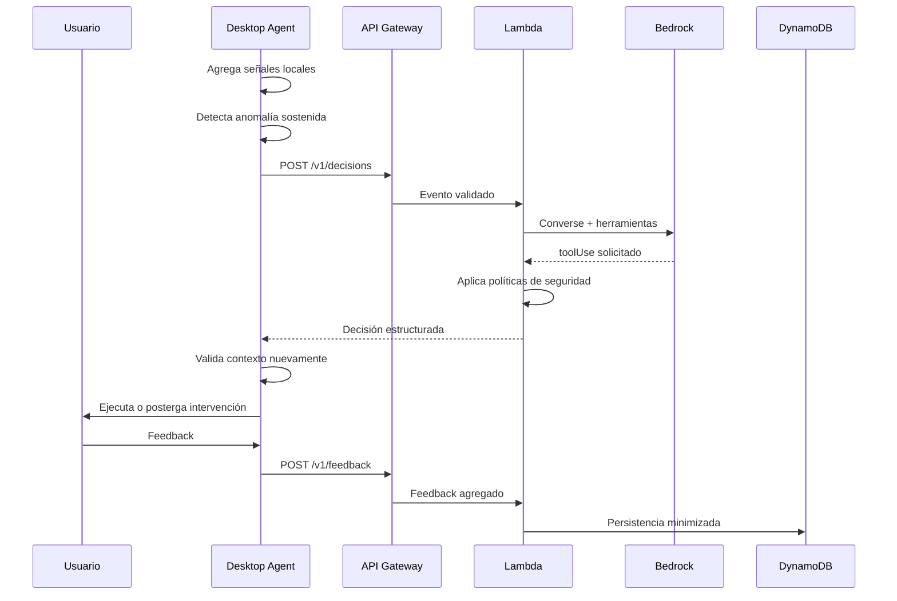

# Arquitectura de LAMINAR Agent

## 1. Objetivos arquitectónicos

1. Mantener datos sensibles dentro del dispositivo.
2. Usar el LLM como motor de decisión, no como generador decorativo.
3. Reducir llamadas a Bedrock mediante activación por anomalías.
4. Ejecutar acciones únicamente mediante herramientas permitidas.
5. Mantener un modo demostración reproducible.
6. Desplegar una experiencia pública sin exigir que el navegador acceda a Windows.
7. Permitir reemplazar el modelo sin reescribir el agente local.

## 2. Principios

- **Local-first:** sensores, agregación y primera detección ocurren en Windows.
- **Content-blind:** no se almacena contenido escrito.
- **Event-triggered AI:** Bedrock se invoca solo cuando una anomalía persiste.
- **Tool-constrained:** el modelo selecciona herramientas; no ejecuta código libre.
- **Defense in depth:** Lambda y escritorio validan la misma decisión.
- **Graceful degradation:** sin AWS, el agente continúa en modo local.
- **Human control:** el usuario puede posponer, silenciar o cerrar la intervención.

## 3. Componentes

### 3.1 Desktop Agent

Módulos sugeridos:

```text
desktop-agent/
├── src/
│   ├── Kandace.App/
│   ├── Kandace.Domain/
│   ├── Kandace.Sensors/
│   ├── Kandace.Friction/
│   ├── Kandace.Context/
│   ├── Kandace.AgentClient/
│   ├── Kandace.Interventions/
│   └── Kandace.Persistence/
├── tests/
│   ├── Kandace.Domain.Tests/
│   ├── Kandace.Friction.Tests/
│   └── Kandace.Contract.Tests/
└── installer/
```

Responsabilidades:

- capturar contadores mínimos;
- agregar métricas por minuto;
- calcular puntuación provisional;
- detectar anomalía sostenida;
- consultar contexto protegido;
- llamar a la API;
- validar respuesta;
- ejecutar herramienta;
- recoger feedback;
- mostrar estado y privacidad.

### 3.2 Backend Orchestrator

```text
backend/
├── src/
│   ├── handlers/
│   ├── agent/
│   ├── bedrock/
│   ├── tools/
│   ├── validation/
│   ├── persistence/
│   └── observability/
├── tests/
└── package.json
```

Responsabilidades:

- autenticar petición del demo;
- validar input;
- construir prompt estructurado;
- declarar herramientas;
- invocar Bedrock Converse API;
- procesar tool use;
- aplicar políticas deterministas;
- devolver acción validada;
- persistir eventos agregados;
- emitir métricas de CloudWatch.

### 3.3 Dashboard y landing

```text
dashboard/
├── src/
│   ├── pages/
│   ├── components/
│   ├── features/
│   ├── api/
│   └── mocks/
├── public/
└── tests/
```

Vistas del MVP:

- landing del producto;
- simulador web del agente;
- tendencias agregadas;
- privacidad;
- descarga;
- arquitectura;
- estado de AWS;
- resultados de validación.

## 4. Secuencia principal



## 5. Herramientas del agente

Las cinco primeras son **acciones canónicas de decisión** devueltas por `/v1/decisions`. `save_feedback` no es una acción de decisión: se registra mediante el endpoint `/v1/feedback` (ver `CONTRATOS_API.md`).

### `do_nothing`

Uso: situación estable o evidencia insuficiente.

### `show_subtle_notification`

Uso: fricción moderada y contexto disponible.

### `postpone_intervention`

Uso: reunión, pantalla compartida, presentación o pausa reciente.

### `launch_bubble_recovery`

Uso: fricción sostenida, usuario disponible y preferencia compatible.

### `enable_quiet_mode`

Uso: usuario solicita no molestar por un tiempo.

### `save_feedback`

Uso: registrar utilidad o falso positivo.

## 6. Guardas deterministas

El LLM no puede superar estas reglas:

1. Si `screen_sharing=true`, no ejecutar overlay.
2. Si `meeting_active=true`, no ejecutar recuperación.
3. Si `quiet_mode=true`, solo `do_nothing`.
4. Si `last_intervention_minutes < cooldown`, no repetir.
5. Duración máxima de recuperación: 60 segundos (tope canónico del MVP; ver ADR-014).
6. El usuario siempre puede salir.
7. Acciones desconocidas se convierten en `do_nothing`.

## 7. Modelo de despliegue

### Descargable

- ejecutable portable para la demo;
- instalador MSIX o MSI si el tiempo lo permite;
- configuración de endpoint mediante `.json`;
- icono de bandeja;
- modo demo sin permisos avanzados.

### AWS

- Amplify Hosting: landing y dashboard.
- API Gateway HTTP API: `/v1/decisions`, `/v1/feedback`, `/v1/metrics`.
- Lambda: orquestación.
- Bedrock Runtime Converse API: decisión y tool use.
- DynamoDB: eventos agregados.
- CloudWatch: logs, métricas, alarmas.
- AWS SAM: infraestructura reproducible (ADR-003).

## 8. RAG y MCP

### MVP

No son obligatorios para probar el ciclo. El MVP usa tool use de Bedrock y una pequeña base local de preferencias.

### Mejora posterior

- **RAG:** recuperar intervenciones y preferencias previamente útiles.
- **MCP:** exponer sensores, contexto e intervenciones mediante un servidor local estándar.

No implementar ambos hasta estabilizar contratos y flujo básico.

## 9. Fallback local

Cuando AWS falla:

```text
friction < 0.70 -> no hacer nada
0.70-0.85 -> notificación discreta
> 0.85 y contexto libre -> sugerencia opcional
contexto protegido -> postergar
```

Debe indicarse claramente que esta es una política local y no una decisión del LLM.

## 10. Calidad del producto

- interfaz sin aspecto de panel técnico;
- animaciones suaves y desactivables;
- mensajes breves;
- accesibilidad y reducción de movimiento;
- estado de privacidad visible;
- latencia percibida inferior a la duración de una notificación;
- errores comprensibles;
- modo offline;
- telemetría minimizada;
- demo consistente.
